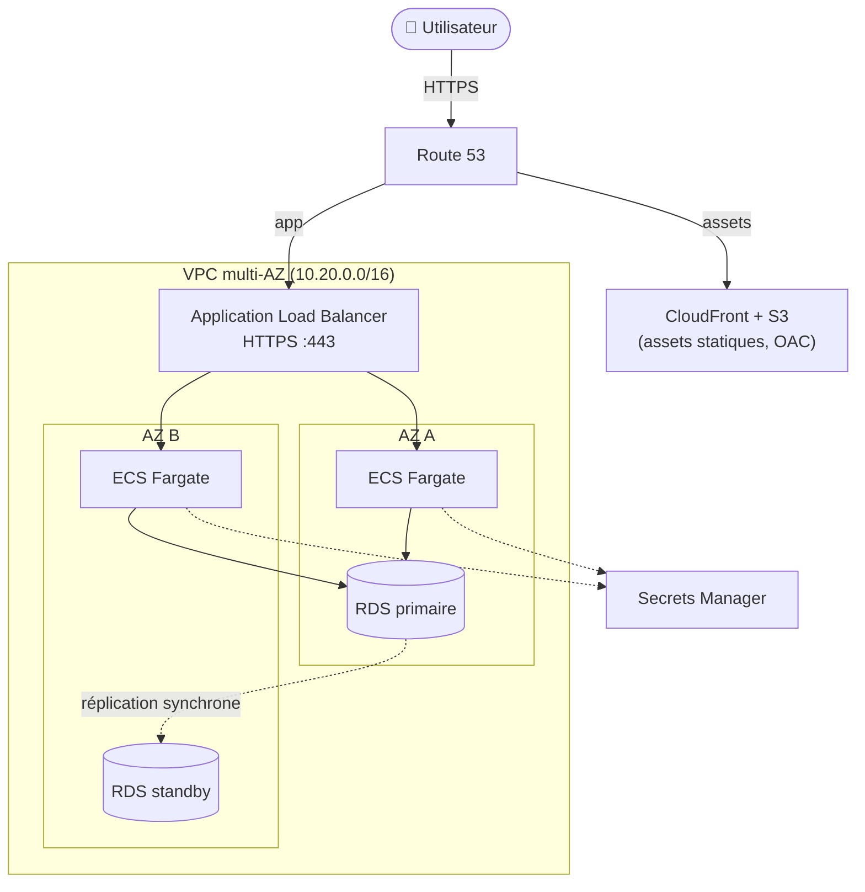

# 🌐 Application web 3-tiers haute disponibilité sur AWS

_L'architecture de référence AWS Well-Architected — VPC multi-AZ, ALB, ECS Fargate et RDS PostgreSQL Multi-AZ — déployée et détruite à 100 % par Infrastructure as Code et CI/CD._


> Démonstration *production-grade* d'une application web 3-tiers tolérante à la panne d'une zone de disponibilité.
> Tout est codé (Terraform + GitHub Actions) : `make deploy` crée l'ensemble, `make destroy` ne laisse rien derrière.

---

## 📋 Sommaire

- [🎯 Contexte & objectif](#-contexte--objectif)
- [🏗️ Architecture](#️-architecture)
- [🧱 Stack technique](#-stack-technique)
- [📁 Structure du dépôt](#-structure-du-dépôt)
- [✅ Prérequis](#-prérequis)
- [🚀 Démarrage rapide](#-démarrage-rapide)
- [🔑 Points clés d'implémentation](#-points-clés-dimplémentation)
- [📊 Observabilité](#-observabilité)
- [🔐 Sécurité](#-sécurité)
- [💰 Coûts & teardown](#-coûts--teardown)
- [🧪 Tests & validation](#-tests--validation)
- [🗺️ Roadmap](#️-roadmap)
- [🎓 Ce que ce projet démontre](#-ce-que-ce-projet-démontre)
- [📄 Licence](#-licence)

---

## 🎯 Contexte & objectif

La grande majorité des applications web d'entreprise reposent sur le même patron :
une **couche de présentation** (edge/CDN + load balancer), une **couche
applicative** sans état et scalable, et une **couche de données** persistante.
Ce dépôt matérialise ce patron en suivant les piliers du **AWS Well-Architected
Framework** (fiabilité, sécurité, performance, optimisation des coûts,
excellence opérationnelle).

**Objectifs concrets :**

- Déployer une application 3-tiers **tolérante à la perte d'une AZ entière**.
- **Tout automatiser** : aucune action manuelle dans la console (zéro ClickOps).
- Démontrer la **scalabilité** (autoscaling), le **découplage** (tiers isolés
  par Security Groups), et la **sécurité par défaut** (chiffrement, secrets,
  moindre privilège).
- Rester **cost-safe** : un `make destroy` détruit tout, et les coûts récurrents
  (NAT Gateway, RDS) sont documentés.

---

## 🏗️ Architecture

Architecture 3-tiers répartie sur **2 zones de disponibilité**. Le détail complet
(flux requête, sécurité réseau, mécanismes HA) est dans
[`docs/architecture.md`](./docs/architecture.md).



**Flux d'une requête :** l'utilisateur passe par **Route 53** ; les assets
statiques sont servis par **CloudFront** depuis un bucket **S3** privé (OAC),
tandis que les requêtes dynamiques atteignent l'**ALB** (terminaison TLS,
redirection HTTP→HTTPS). L'ALB répartit la charge sur les tâches **ECS Fargate**
saines des deux AZ, qui interrogent **RDS PostgreSQL**, identifiants injectés
depuis **Secrets Manager**.

**Haute disponibilité :**

- **Multi-AZ** — réseau, tâches applicatives et base sont dupliqués sur 2 AZ.
- **Autoscaling** — le service ECS suit une cible d'utilisation CPU (60 %) et
  ajuste le nombre de tâches (min 2, max 6).
- **Bascule RDS** — un standby synchrone est promu automatiquement en 60–120 s
  si la primaire tombe ; le point de terminaison DNS est repointé de façon
  transparente (voir [ADR 0002](./docs/adr/0002-rds-multi-az.md)).

---

## 🧱 Stack technique

| Composant | Rôle | Pourquoi ce choix |
|-----------|------|-------------------|
| **Terraform** | Provisionnement de toute l'infrastructure (modules) | Standard IaC multi-cloud, état partagé, modulaire et réutilisable |
| **VPC multi-AZ** | Isolation réseau, sous-réseaux public/app/data sur 2 AZ | Fondation de la HA et de la segmentation par tier |
| **Application Load Balancer** | Point d'entrée L7, TLS, health checks | Routage HTTP/HTTPS natif multi-AZ, intégration directe ECS |
| **ECS Fargate** | Exécution des conteneurs applicatifs, auto-scalés | Serverless conteneur : zéro gestion d'hôte ([ADR 0001](./docs/adr/0001-ecs-fargate-vs-ec2.md)) |
| **RDS PostgreSQL Multi-AZ** | Tier données persistant avec bascule | HA managée, bascule automatique, sauvegardes ([ADR 0002](./docs/adr/0002-rds-multi-az.md)) |
| **S3 + CloudFront (OAC)** | Diffusion des assets statiques en edge | Décharge l'app, cache mondial, S3 jamais exposé publiquement |
| **Route 53** | DNS et alias vers ALB/CloudFront | DNS managé, alias gratuits, health checks possibles |
| **Secrets Manager + KMS** | Stockage chiffré des identifiants DB | Aucun secret en clair, rotation possible, audit |
| **ECR** | Registre d'images Docker privé | Intégration native ECS/IAM, scan d'images |
| **CloudWatch** | Logs, métriques, alarmes, Container Insights | Observabilité unifiée du runtime AWS |
| **GitHub Actions (OIDC)** | CI/CD : lint, test, scan, build, déploiement | Pas de clés AWS stockées ; pipeline déclaratif |
| **Docker (multi-stage)** | Empaquetage de l'app, image minimale non-root | Builds reproductibles, surface d'attaque réduite |
| **Flask + Gunicorn** | Application web de démonstration | Léger, lisible, suffisant pour illustrer les 3 tiers |

---

## 📁 Structure du dépôt

```text
02-webapp-3tier-ha/
├── README.md                         # Ce document
├── Makefile                          # build / test / deploy / destroy / plan / docker-run-local
├── docker-compose.yml                # App + Postgres en local
├── .gitignore
├── LICENSE                           # MIT
├── docs/
│   ├── architecture.md               # Diagramme Mermaid + flux + HA
│   └── adr/
│       ├── 0001-ecs-fargate-vs-ec2.md
│       └── 0002-rds-multi-az.md
├── app/                              # Tier applicatif (conteneur)
│   ├── Dockerfile                    # Multi-stage, utilisateur non-root
│   ├── app.py                        # Flask : /, /health, /db
│   ├── requirements.txt              # Dépendances de production
│   ├── requirements-dev.txt          # Dépendances CI (flake8, pytest)
│   ├── setup.cfg                     # Configuration flake8 / pytest
│   ├── test_app.py                   # Tests unitaires
│   └── templates/
│       └── index.html                # Page « Démo 3-tiers HA »
├── terraform/
│   ├── providers.tf                  # Providers AWS (+ alias us-east-1)
│   ├── backend.tf                    # Backend S3 (config à l'init)
│   ├── variables.tf
│   ├── main.tf                       # Câblage des modules
│   ├── outputs.tf
│   ├── terraform.tfvars.example
│   └── modules/
│       ├── network/                  # VPC, subnets, IGW, NAT, routes, flow logs
│       ├── alb/                      # ALB, target group, listeners HTTP/HTTPS
│       ├── ecs/                      # Cluster, task def, service, autoscaling, ECR
│       ├── rds/                      # PostgreSQL Multi-AZ, KMS, Secrets Manager
│       └── cdn/                      # S3 (OAC) + CloudFront
└── .github/
    └── workflows/
        ├── ci.yml                    # Lint, test, build, scan Trivy, push ECR (OIDC)
        └── deploy.yml                # Terraform fmt/validate/plan/apply + redeploy ECS (OIDC)
```

---

## ✅ Prérequis

| Outil | Version conseillée | Usage |
|-------|--------------------|-------|
| [Terraform](https://developer.hashicorp.com/terraform/downloads) | ≥ 1.6 | Provisionnement de l'infrastructure |
| [AWS CLI](https://aws.amazon.com/cli/) | ≥ 2.x | Authentification, déploiement ECS, tests |
| [Docker](https://docs.docker.com/get-docker/) | ≥ 24 | Build d'image, exécution locale |
| [Python](https://www.python.org/) | 3.12 | Lint et tests applicatifs en local |
| `make` | — | Raccourcis du cycle de vie |

Côté AWS :

- Un **compte AWS** et des droits suffisants (VPC, ECS, RDS, IAM, ACM, CloudFront…).
- Un **certificat ACM** valide dans la région cible (pour le listener HTTPS de
  l'ALB). Pour CloudFront, un certificat dans **us-east-1** (optionnel).
- Un **bucket S3** et une **table DynamoDB** pour le backend Terraform distant
  (état + verrouillage).
- Pour la CI/CD : un **rôle IAM OIDC** approuvant le fournisseur GitHub Actions.

---

## 🚀 Démarrage rapide

### En local (docker-compose)

Lance l'application Flask et une base PostgreSQL locale (qui remplace RDS) :

```bash
make docker-run-local
# équivaut à : docker compose up --build
```

Puis :

- Page de démo : <http://localhost:8000>
- Health check : <http://localhost:8000/health>
- Test base : <http://localhost:8000/db>

Lint et tests :

```bash
make install-dev   # flake8 + pytest
make lint
make test
```

Pour arrêter et nettoyer (volumes compris) :

```bash
make docker-stop-local
```

### Déploiement sur AWS

1. **Configurer les variables** :

   ```bash
   cd terraform
   cp terraform.tfvars.example terraform.tfvars
   # Renseigner au minimum alb_certificate_arn, aws_region, availability_zones
   ```

2. **Initialiser** le backend distant (adapter les valeurs) :

   ```bash
   terraform init \
     -backend-config="bucket=mon-bucket-tfstate" \
     -backend-config="key=02-webapp-3tier-ha/terraform.tfstate" \
     -backend-config="region=eu-west-3" \
     -backend-config="dynamodb_table=terraform-locks"
   ```

3. **Planifier puis appliquer** :

   ```bash
   make plan
   make deploy        # terraform apply -auto-approve
   ```

4. **Construire et pousser l'image**, puis redéployer le service :

   ```bash
   make ecr-login
   make push    REPO_URL=$(cd terraform && terraform output -raw ecr_repository_url) IMAGE_TAG=$(git rev-parse --short HEAD)
   make redeploy CLUSTER=$(cd terraform && terraform output -raw ecs_cluster_name) \
                 SERVICE=$(cd terraform && terraform output -raw ecs_service_name)
   ```

5. **Accéder à l'application** via l'URL renvoyée :

   ```bash
   cd terraform && terraform output application_url
   ```

> En CI/CD, ces étapes sont automatisées par `.github/workflows/ci.yml`
> (build/scan/push) et `.github/workflows/deploy.yml` (terraform + redeploy).

---

## 🔑 Points clés d'implémentation

### Multi-AZ de bout en bout

Le module `network` crée, pour **chaque AZ**, un trio de sous-réseaux
(public/app/data) et une **NAT Gateway dédiée** — aucun point de défaillance
inter-AZ. ALB, service ECS et RDS s'étendent sur les 2 AZ.

### Autoscaling par suivi de cible

Le module `ecs` attache une politique `TargetTrackingScaling` sur
`ECSServiceAverageCPUUtilization` (cible **60 %**), bornée par `min_capacity = 2`
(une tâche par AZ au minimum) et `max_capacity = 6`. Fenêtres de refroidissement :
60 s en montée, 300 s en descente.

### Health checks à deux niveaux

- **ALB** → `GET /health` (HTTP 200, 2 succès = sain, 3 échecs = retiré).
- **Conteneur** → `HEALTHCHECK` Docker + `healthCheck` ECS, qui interrogent
  aussi `/health`. La route `/health` **ne touche pas la base** : un incident
  RDS transitoire ne désinscrit pas toutes les tâches.

### Secrets Manager (aucun secret en clair)

Le module `rds` génère un mot de passe aléatoire (`random_password`), le stocke
dans un secret **chiffré KMS**, et la task definition ECS l'injecte via le bloc
`secrets` (références `valueFrom`) — jamais en variable d'environnement en clair,
jamais dans l'état Terraform exposé.

### Moindre privilège sur les Security Groups

Chaînage strict, **référencé par Security Group** (pas par CIDR) :
`Internet → SG ALB (80/443) → SG ECS (8000) → SG RDS (5432)`. Chaque maillon
n'accepte en entrée que la source immédiatement en amont. La règle reliant ECS et
RDS est définie à la racine pour éviter un cycle de dépendances entre modules.

---

## 📊 Observabilité

| Signal | Source | Détail |
|--------|--------|--------|
| **Logs applicatifs** | CloudWatch Logs (`/ecs/<prefixe>-app`) | Driver `awslogs`, rétention configurable (30 j par défaut) |
| **Logs réseau** | VPC Flow Logs (`/vpc/<prefixe>/flow-logs`) | Tout le trafic du VPC, pour audit et dépannage |
| **Métriques conteneurs** | ECS Container Insights | CPU, mémoire, nombre de tâches par service |
| **Métriques base** | RDS + Performance Insights + Enhanced Monitoring | Charge, connexions, métriques OS (intervalle 60 s) |
| **Alarme CPU ECS** | CloudWatch Alarm | > 85 % pendant 5 min → notification SNS |
| **Alarme stockage RDS** | CloudWatch Alarm | Espace libre < 2 Gio → notification SNS |
| **Logs base exportés** | CloudWatch (`postgresql`, `upgrade`) | Journaux PostgreSQL et de mise à niveau |

Les alarmes publient sur un **topic SNS** (abonnement e-mail) si `alarm_email`
est renseigné. Un tableau de bord CloudWatch peut être ajouté pour agréger
métriques ALB (latence, 5xx), ECS (CPU/mémoire) et RDS (connexions) — voir la
[Roadmap](#️-roadmap).

---

## 🔐 Sécurité

- **Security Groups en moindre privilège** — sources référencées par SG, jamais
  d'ouverture large ; sous-réseaux `data` sans aucune route vers Internet.
- **Chiffrement au repos** — RDS et secret chiffrés par **clé KMS dédiée**
  (rotation activée) ; bucket S3 chiffré (SSE-S3) ; dépôt ECR chiffré.
- **Chiffrement en transit** — HTTPS sur l'ALB (politique **TLS 1.2/1.3**),
  redirection systématique HTTP→HTTPS, `rds.force_ssl = 1` côté base,
  CloudFront en `redirect-to-https`.
- **Secrets gérés** — identifiants DB dans **Secrets Manager**, injectés au
  runtime, jamais commités ni exposés en clair.
- **Image non-root** — l'image Docker est **multi-stage** (pas d'outils de build
  dans l'image finale) et s'exécute sous un **utilisateur non privilégié**
  (`uid 10001`).
- **S3 non public** — *block public access* total ; seul **CloudFront via OAC**
  peut lire le bucket (condition sur l'ARN de la distribution).
- **CI/CD sans clés** — authentification AWS par **OIDC** ; scan d'image
  **Trivy** (échec sur CRITICAL/HIGH) ; `scan_on_push` activé sur ECR ;
  images ECR **immutables**.

---

## 💰 Coûts & teardown

Estimation indicative (région `eu-west-3`, configuration par défaut, **hors
Free Tier**). Les coûts varient selon le trafic et la durée d'exécution.

| Poste | Configuration | Coût approximatif / mois |
|-------|---------------|--------------------------|
| **NAT Gateway** | 2 (une par AZ) | ~65 $ (≈ 32 $ chacune + trafic) |
| **RDS PostgreSQL** | `db.t4g.micro` **Multi-AZ** | ~30–35 $ (primaire + standby) |
| **Application Load Balancer** | 1 ALB | ~18 $ + LCU |
| **ECS Fargate** | 2 tâches 0,25 vCPU / 512 Mo | ~15–20 $ |
| **CloudFront + S3** | Faible volume de démo | ~1–3 $ |
| **Route 53** | 1 zone hébergée | ~0,50 $ |
| **CloudWatch / KMS / Secrets** | Logs + 1 clé + 1 secret | ~3–5 $ |
| **Total estimé** | | **~135–150 $ / mois** |

> ⚠️ **Avertissement coût.** Les **NAT Gateways** et **RDS Multi-AZ** sont les
> postes les plus onéreux et facturés **en continu**, même sans trafic.
> **Détruisez l'infrastructure après chaque démo.**

**Réduire les coûts en dev :**

- `single_nat_gateway = true` → une seule NAT (~32 $/mois économisés, perd la HA
  inter-AZ pour la sortie).
- `db_multi_az = false` → RDS Single-AZ (sacrifie la HA données).

**Tout détruire :**

```bash
make destroy        # terraform destroy -auto-approve
```

Le teardown est conçu pour être propre : `force_destroy`/`force_delete` sur S3 et
ECR, `skip_final_snapshot` et `recovery_window = 0` sur RDS/Secrets en dev.

---

## 🧪 Tests & validation

### Qualité applicative (local + CI)

```bash
make lint     # flake8
make test     # pytest : /health, page d'accueil, gestion d'erreur /db
```

### Validation de l'infrastructure

```bash
make fmt        # terraform fmt -recursive
make validate   # terraform init -backend=false && terraform validate
make plan       # revue du plan avant apply
```

### Validation fonctionnelle (post-déploiement)

```bash
URL=$(cd terraform && terraform output -raw application_url)
curl -fsS "$URL/health"   # attendu : {"status":"ok",...}
curl -fsS "$URL/db"       # attendu : {"status":"ok","database":"postgresql",...}
```

### Test de bascule d'AZ (failover RDS) 🔁

Force une bascule contrôlée vers le standby et vérifie le retour à la normale :

```bash
DB_ID=$(cd terraform && terraform output -raw rds_endpoint | cut -d. -f1)

# Déclenche la bascule Multi-AZ
aws rds reboot-db-instance --db-instance-identifier "$DB_ID" --force-failover

# Pendant la bascule (~60–120 s), /db peut renvoyer 503 :
watch -n 5 'curl -s -o /dev/null -w "%{http_code}\n" '"$URL"'/db'
# Le code repasse à 200 une fois le standby promu, sans changer la chaîne de connexion.
```

On peut également **désactiver une tâche ECS** (ou simuler la perte d'une AZ) et
observer que l'ALB continue de servir le trafic via les tâches de l'autre AZ,
puis qu'ECS reprogramme la tâche manquante.

---

## 🗺️ Roadmap

- [ ] **WAF** devant CloudFront/ALB (règles managées, protection L7).
- [ ] **Tableau de bord CloudWatch** consolidé (ALB 5xx/latence, ECS, RDS).
- [ ] **Pipeline blue/green** via CodeDeploy pour le service ECS.
- [ ] **Rotation automatique** du secret RDS (Lambda de rotation Secrets Manager).
- [ ] **Read replicas** ou migration **Aurora** si la charge en lecture l'exige.
- [ ] **Tests d'intégration** post-déploiement dans la CI (smoke tests `curl`).
- [ ] **VPC Endpoints** (ECR, Secrets Manager, CloudWatch) pour supprimer la
      dépendance NAT et réduire les coûts/exposition.
- [ ] **Auto Scaling planifié** (scale-down nocturne) pour les environnements hors prod.

---

## 🎓 Ce que ce projet démontre

### Mapping AWS Solutions Architect Associate (SAA)

| Domaine SAA | Mise en œuvre dans ce projet |
|-------------|------------------------------|
| **Conception d'architectures résilientes** | Multi-AZ (réseau, ECS, RDS), bascule automatique, auto-réparation ECS, ALB multi-AZ |
| **Architectures haute performance** | Autoscaling ECS, CloudFront en edge, RDS gp3 + Performance Insights |
| **Architectures sécurisées** | SG moindre privilège, KMS, Secrets Manager, TLS de bout en bout, S3 privé via OAC |
| **Architectures optimisées en coût** | Fargate à la tâche, option NAT unique / Single-AZ en dev, teardown complet, documentation des coûts |

### Compétences DevOps

- **Infrastructure as Code** modulaire et réutilisable (Terraform, 5 modules).
- **CI/CD** complète : lint, tests, scan de sécurité (Trivy), build et push
  d'image, déploiement Terraform — le tout en **OIDC sans secret stocké**.
- **Conteneurs** : image Docker multi-stage, non-root, health-checkée.
- **DevSecOps** : scan d'image, chiffrement systématique, secrets gérés, moindre
  privilège, état chiffré.
- **Observabilité / SRE** : logs centralisés, métriques, alarmes, Container
  Insights, VPC Flow Logs.
- **Cost-awareness (FinOps)** : estimation chiffrée, leviers d'économie, culture
  du teardown.

---

## 📄 Licence

Distribué sous licence **MIT**. Voir le fichier [`LICENSE`](./LICENSE).

> ⚠️ Pensez à remplacer `Noumabeu Moutacdie Jordan` dans le fichier `LICENSE` ainsi que les
> identifiants/ARN d'exemple (compte AWS, certificats) avant publication.
