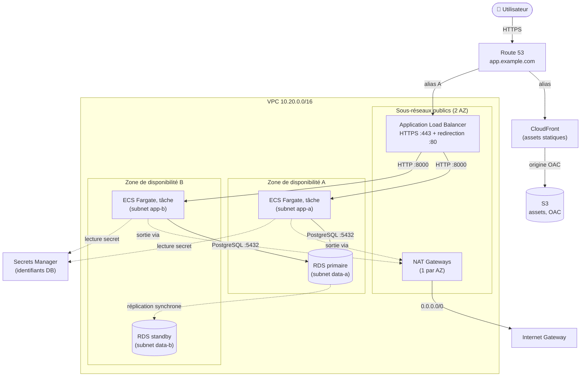

# 🏗️ Architecture, Application web 3-tiers haute disponibilité

Ce document détaille l'architecture de référence, le flux d'une requête et les
mécanismes de haute disponibilité (HA).

## Vue d'ensemble

L'architecture suit le modèle **3-tiers** recommandé par le *AWS
Well-Architected Framework*, déployé sur **deux zones de disponibilité (AZ)**
pour tolérer la perte complète d'une AZ.

| Tier | Rôle | Service AWS |
|------|------|-------------|
| **Présentation / edge** | Diffusion des assets statiques, terminaison TLS, point d'entrée | CloudFront, S3, Application Load Balancer, Route 53 |
| **Application** | Logique métier conteneurisée, sans état, auto-scalée | ECS Fargate |
| **Données** | Persistance relationnelle, bascule automatique | RDS PostgreSQL Multi-AZ |

## Diagramme

## Flux d'une requête

1. **Résolution DNS**, l'utilisateur résout `app.example.com` via **Route 53**.
   Les assets statiques (`*.cloudfront.net` ou un sous-domaine) pointent vers
   **CloudFront** ; l'application dynamique pointe (alias A) vers l'**ALB**.
2. **Assets statiques**, **CloudFront** sert les fichiers depuis le bucket
   **S3** privé via un **Origin Access Control (OAC)** : S3 n'est jamais exposé
   publiquement, seul CloudFront peut le lire.
3. **Requête applicative**, l'**ALB** termine le TLS (certificat **ACM**,
   politique TLS 1.2/1.3) et redirige systématiquement le port 80 vers 443.
4. **Routage vers les tâches**, l'ALB répartit la charge sur les tâches
   **ECS Fargate** saines des **deux AZ** (cibles de type `ip`, mode réseau
   `awsvpc`). Le *health check* interroge `/health`.
5. **Accès aux données**, chaque tâche se connecte au point de terminaison
   **RDS PostgreSQL** (port 5432). Les identifiants sont injectés depuis
   **Secrets Manager** dans l'environnement du conteneur, jamais en clair.
6. **Sortie Internet**, pour tirer leur image ECR ou joindre les API AWS, les
   tâches (en sous-réseaux privés) sortent par les **NAT Gateways**, puis par
   l'**Internet Gateway**.

## Haute disponibilité

### Multi-AZ de bout en bout

- **Réseau** : sous-réseaux public/app/data dupliqués dans **2 AZ**, chacune
  dotée de sa propre NAT Gateway (pas de point de défaillance inter-AZ).
- **Tier applicatif** : le service ECS maintient au minimum **2 tâches**
  réparties sur les 2 AZ. La perte d'une AZ laisse l'application servie par
  l'autre ; ECS reprogramme les tâches manquantes automatiquement.
- **Load balancer** : l'ALB est nativement multi-AZ et ne route que vers les
  cibles saines.

### Autoscaling

Le service ECS est piloté par une politique de **suivi de cible** sur
l'utilisation CPU moyenne (60 %). En cas de pic de trafic, de nouvelles tâches
sont lancées (jusqu'à `max_capacity`) ; elles sont retirées au reflux après une
fenêtre de stabilisation, optimisant ainsi le coût.

### Bascule RDS Multi-AZ

RDS provisionne une **instance de secours (standby)** dans la seconde AZ,
maintenue par **réplication synchrone**. En cas de panne de l'instance primaire
(défaillance matérielle, perte d'AZ, maintenance), RDS **bascule
automatiquement** : l'enregistrement DNS du point de terminaison est repointé
vers le standby promu, généralement en **60 à 120 secondes**. L'application n'a
pas à changer de chaîne de connexion, elle utilise le nom DNS, pas l'IP. Voir
l'[ADR 0002](./adr/0002-rds-multi-az.md).

### Auto-réparation

- ECS remplace toute tâche dont le *health check* échoue.
- Le *deployment circuit breaker* annule et restaure (rollback) un déploiement
  défaillant.
- L'ALB désinscrit automatiquement les cibles non saines du target group.

## Sécurité réseau (moindre privilège)

Chaque Security Group n'autorise en entrée que la source strictement nécessaire,
**référencée par Security Group** (et non par plage CIDR) :

- **SG ALB** : entrée 80/443 depuis Internet.
- **SG ECS** : entrée 8000 **uniquement depuis le SG de l'ALB**.
- **SG RDS** : entrée 5432 **uniquement depuis le SG des tâches ECS**.

Les sous-réseaux `data` n'ont **aucune route vers Internet** (ni IGW, ni NAT).
